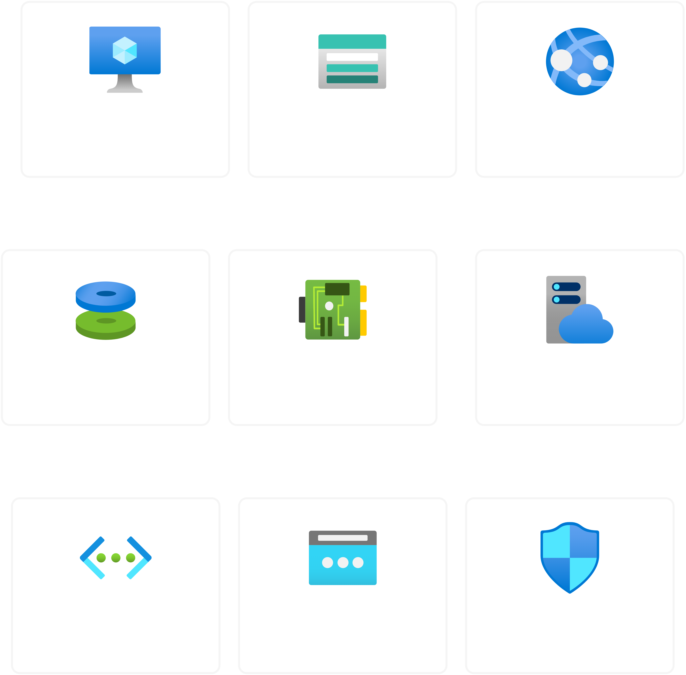

# Azure Foundation Setup

> cloud infrastructure using Terraform IaC

## Overview
Complete Azure foundation setup for a startup company migration including 
compute, storage, networking, and web application hosting. Deployed using 
Terraform for scalable, repeatable infrastructure management.

## Architecture

## Architecture Components

| Component | Specification | Purpose | Est. Monthly Cost |
|-----------|--------------|---------|-------------------|
| **Virtual Machine** | Windows Server 2022 (Standard_B1ms, Zone 1) | Application server deployment | 2,325 LKR (~$7.50) |
| **Web Application** | Linux App Service (B1, Node.js 22 LTS) | Customer portal deployment | 4,030 LKR (~$13) |
| **Storage Account** | StorageV2, RAGRS, Hot tier | File system and backups | 1,550 LKR (~$5) |
| **Virtual Network** | VNet + Subnet + NSG | Network isolation and security | 930 LKR (~$3) |
| **Public IP** | Static, Standard SKU | External VM access | 465 LKR (~$1.50) |
| **Total** | | | **9,300 LKR (~$30)** |

### Budget Configuration
- **Budget Limit**: LKR 12,000/month (or ~$40 USD/month)
- **Budget Alerts**: Configured at 80% (LKR 9,600) and 100% (LKR 12,000)
- **Reserved Capacity**: 2,700 LKR available for scaling and data transfer costs

